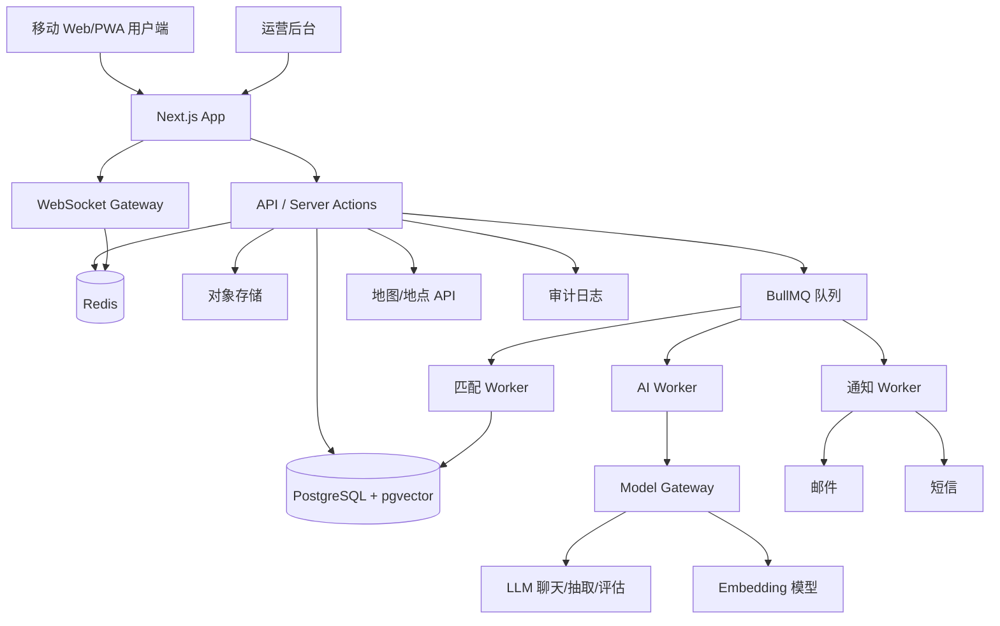
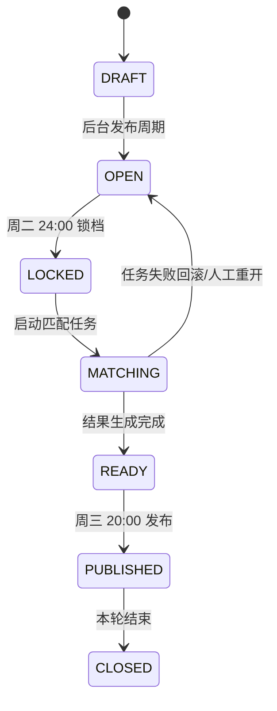
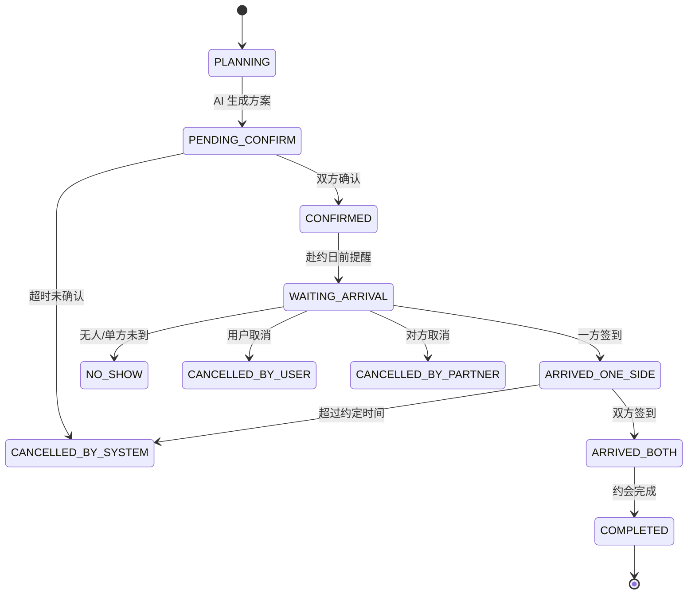
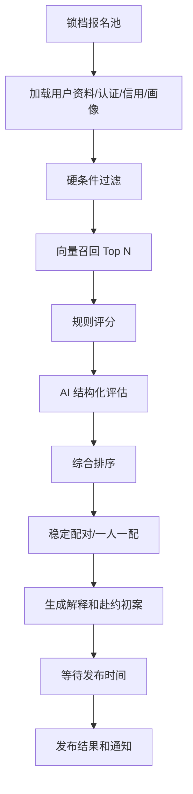
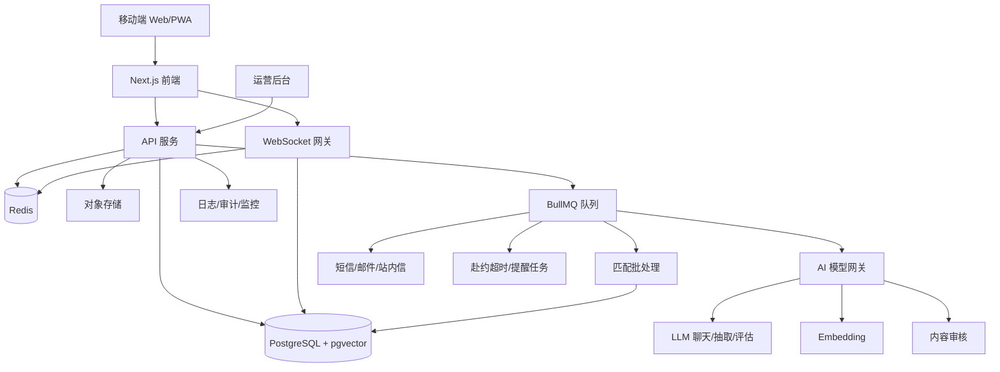
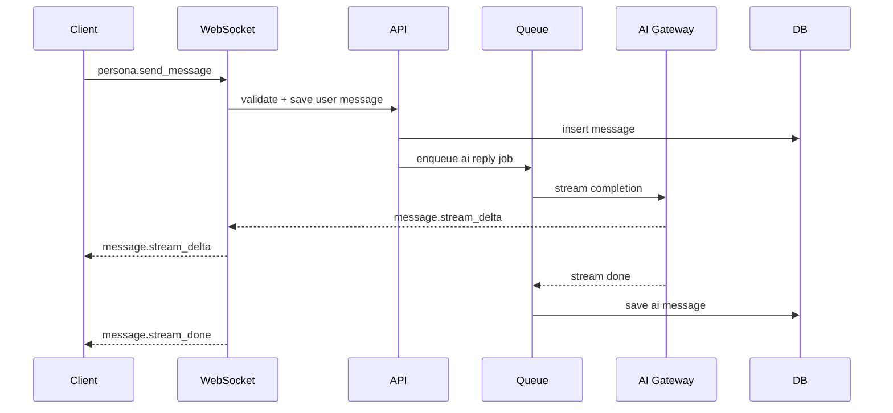
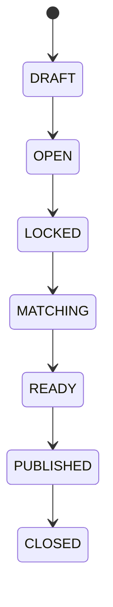
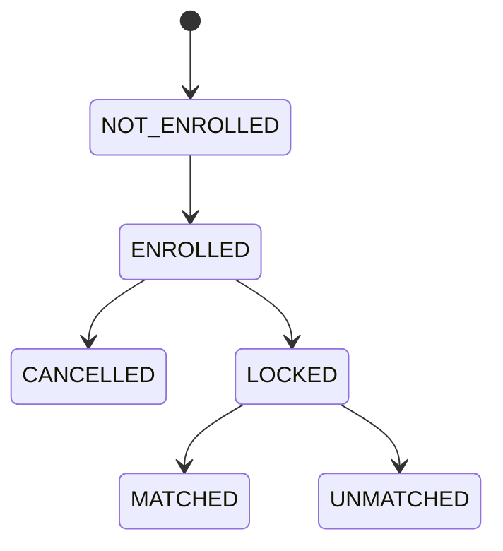
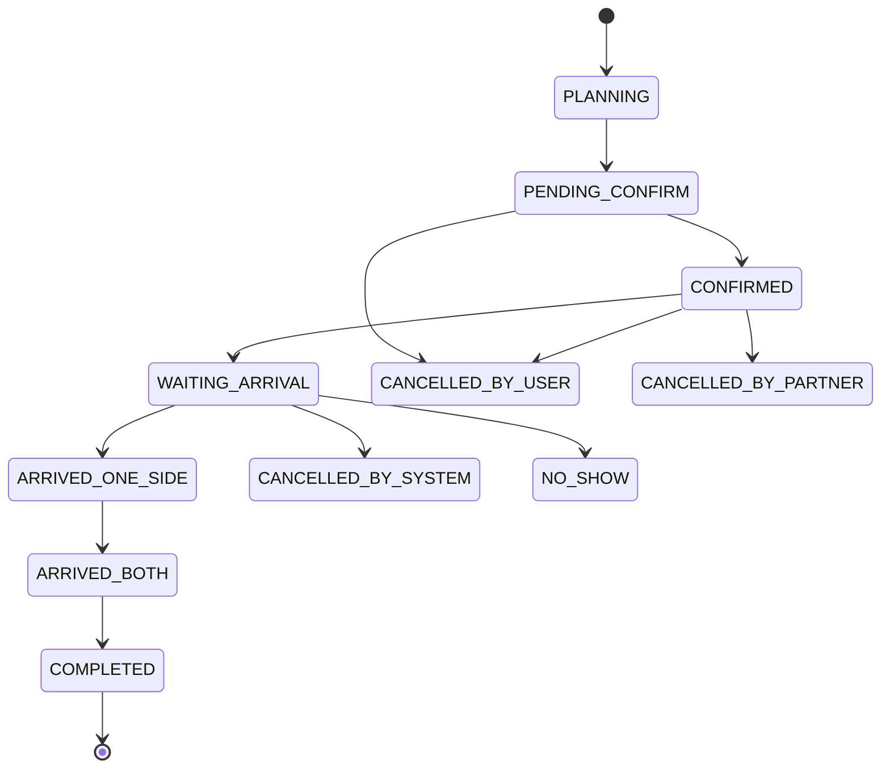

# AI 线下匹配网站复刻技术书

生成日期：2026-06-10  
需求来源：[Function.md](Function.md) 的实地功能探索  
目标：实现一个与 ONCE 机制相似、但品牌、文案、视觉、数据和 Prompt 均独立的 AI 线下相亲/交友匹配产品。

> 合规边界：本文讨论的是复刻产品机制与技术闭环，不复制 ONCE 的商标、Logo、UI 素材、专有文案、真实用户数据、内部接口、内部 Prompt 或商业资料。正式上线前需要独立品牌、独立视觉、独立协议、独立隐私政策和线下安全规则。

## 1. 产品技术目标

要实现的不是一个普通聊天站点，而是一个“AI 画像 + 周期报名 + 匹配算法 + 盲盒赴约 + 履约信用”的完整系统。

第一版技术目标：

1. 移动 Web/PWA 优先，桌面浏览时保持手机容器体验。
2. 用户可以注册登录、填写资料、完成基础认证。
3. 用户可以和 AI 深度聊天，系统沉淀结构化画像。
4. 用户可以按周报名，填写本轮相亲/交友意愿。
5. 系统按城市和匹配周期锁档、计算、发布结果。
6. 匹配前隐藏对方照片等强外貌信息，实现盲盒赴约。
7. AI 协调或辅助生成见面时间、地点、相认方式。
8. 历史记录统一承载 AI 会话、匹配会话、系统通知、赴约状态和反馈。
9. 线下履约情况进入信用分，影响后续匹配。
10. 运营后台可以审核认证、管理用户、查看报名池、人工干预匹配、处理异常。

## 2. 技术选型

### 2.1 推荐 MVP 技术栈

适合 1 到 3 人团队快速做出可用 Beta。

| 层级 | 技术 | 说明 |
| --- | --- | --- |
| Web 前端 | Next.js + React + TypeScript | 同时承载移动 Web、PWA、部分服务端渲染 |
| UI | Tailwind CSS + Radix UI/shadcn 风格组件 | 快速构建弹窗、抽屉、表单、开关、底部导航 |
| 表单 | React Hook Form + Zod | 资料、报名、认证、反馈表单校验 |
| 客户端状态 | Zustand 或 Jotai | 保存当前 Tab、弹窗、会话草稿等轻量状态 |
| 服务端 | Next.js Route Handlers + Server Actions | MVP 可减少前后端拆分成本 |
| ORM | Prisma | 快速建模、迁移、类型生成 |
| 数据库 | PostgreSQL | 主业务库 |
| 向量检索 | pgvector | 画像 embedding 召回候选 |
| 队列 | Redis + BullMQ | AI 摘要、匹配批处理、通知发送 |
| 实时能力 | WebSocket 或 Socket.IO | AI 流式消息、未读、在线状态、匹配通知 |
| AI 网关 | 自建 Model Gateway | 统一 DeepSeek/OpenAI/通义/Claude 等供应商 |
| 文件存储 | S3/OSS/COS | 头像、认证材料、反馈证据 |
| 邮件 | Resend/SendGrid/阿里云邮件 | 邮箱绑定、结果提醒 |
| 短信 | 阿里云/腾讯云短信 | 验证码、重要赴约提醒 |
| 地图 | 高德/腾讯地图/Google Maps | 城市、地点搜索、约会地点建议 |
| 监控 | Sentry + OpenTelemetry | 前后端异常、AI 调用、任务失败追踪 |

### 2.2 生产级演进技术栈

当产品进入真实城市运营后，建议从单体逐步演进：

- Web：Next.js 保持。
- API：从 Next.js API 抽出 NestJS 单体服务。
- 后台：Next.js Admin 或 React Admin 独立部署。
- AI Worker：独立 Node.js/Python Worker 服务，处理画像、embedding、匹配评估。
- 定时任务：BullMQ repeatable jobs 或 Kubernetes CronJob。
- 数据库：PostgreSQL 主库 + 只读副本 + 定期备份。
- 审计：敏感资料、认证材料、后台操作都写 audit_logs。
- 安全：限流、风控、验证码、WAF、对象存储私有读、加密字段。

## 3. 总体架构



### 3.1 核心子系统

| 子系统 | 职责 |
| --- | --- |
| 账号系统 | 登录、会话、手机号/邮箱、退出登录、权限 |
| 用户资料 | 昵称、头像、性别、生日、城市、学校、专业、学历、身份 |
| 认证系统 | 实名认证、学历认证、审核状态、认证徽章、隐私说明 |
| AI 人设系统 | 深度访谈、消息存储、画像摘要、结构化画像、embedding |
| 报名系统 | 每周周期、报名弹窗、本周偏好、锁档规则 |
| 匹配系统 | 硬过滤、向量召回、评分、AI 评估、最终配对 |
| 盲盒权限 | 匹配前后可见字段控制、照片隐藏、相认信息控制 |
| 赴约系统 | 时间地点建议、双方确认、取消、超时、签到、完成 |
| 历史消息 | AI 会话、匹配会话、系统消息、未读、反馈入口 |
| 信用系统 | 爽约、迟到、取消、完成、投诉等 reputation events |
| 通知系统 | 邮件、短信、站内信、WebSocket 推送 |
| 运营后台 | 用户、认证、报名、匹配、赴约、举报、系统配置 |

## 4. 仓库结构

建议使用单仓 monorepo，便于前后端共享类型。

```text
apps/
  web/                         # 用户端 Next.js App
    app/
      (auth)/
      (main)/match/
      (main)/persona/
      (main)/me/
      api/
    components/
      match/
      persona/
      profile/
      chat/
      shared/
    hooks/
    lib/
    styles/
  admin/                       # 运营后台，可后置
    app/
    components/
packages/
  db/                          # Prisma schema、迁移、seed
  shared/                      # 共享类型、Zod schema、常量
  ai/                          # Prompt、模型网关、画像抽取
  matching/                    # 匹配规则、评分算法、稳定匹配
  notifications/               # 邮件、短信、站内信模板
  config/                      # eslint、tsconfig、tailwind config
workers/
  ai-worker/                   # AI 摘要、embedding、评估
  match-worker/                # 周期锁档和匹配批处理
  notify-worker/               # 通知队列
prisma/
  schema.prisma
  migrations/
docs/
  api.md
  prompts.md
  operations.md
```

## 5. 数据模型

### 5.1 枚举设计

```prisma
enum UserRole {
  USER
  ADMIN
  OPERATOR
}

enum UserStatus {
  ACTIVE
  SUSPENDED
  DELETED
}

enum Gender {
  MALE
  FEMALE
  UNKNOWN
}

enum IdentityStatus {
  STUDENT
  ALUMNI
  OTHER
}

enum VerificationType {
  REAL_NAME
  EDUCATION
}

enum VerificationStatus {
  NOT_SUBMITTED
  PENDING
  APPROVED
  REJECTED
  NEEDS_MORE_INFO
  EXPIRED
}

enum MatchCycleStatus {
  DRAFT
  OPEN
  LOCKED
  MATCHING
  READY
  PUBLISHED
  CLOSED
}

enum EnrollmentStatus {
  ENROLLED
  CANCELLED
  LOCKED
  MATCHED
  UNMATCHED
}

enum MatchIntent {
  DATING
  FRIENDSHIP
}

enum DesiredGender {
  MALE
  FEMALE
  ANY
}

enum ConversationType {
  PERSONA_AI
  MATCH_CHAT
  SYSTEM
}

enum MessageSenderType {
  USER
  PARTNER
  AI
  SYSTEM
  ADMIN
}

enum MatchStatus {
  CANDIDATE
  AI_EVALUATING
  SELECTED
  PUBLISHED
  REJECTED
  EXPIRED
}

enum DatePlanStatus {
  PLANNING
  PENDING_CONFIRM
  CONFIRMED
  WAITING_ARRIVAL
  ARRIVED_ONE_SIDE
  ARRIVED_BOTH
  COMPLETED
  CANCELLED_BY_USER
  CANCELLED_BY_PARTNER
  CANCELLED_BY_SYSTEM
  NO_SHOW
  DISPUTED
}
```

### 5.2 用户与资料表

```prisma
model User {
  id             String      @id @default(cuid())
  phone          String?     @unique
  email          String?     @unique
  username       String      @unique
  passwordHash   String?
  role           UserRole    @default(USER)
  status         UserStatus  @default(ACTIVE)
  lastSeenAt     DateTime?
  createdAt      DateTime    @default(now())
  updatedAt      DateTime    @updatedAt

  profile        Profile?
  settings       UserSettings?
  verifications  VerificationRecord[]
  enrollments    MatchEnrollment[]
  conversations  ConversationParticipant[]
  reputation     UserReputation?
}

model Profile {
  id             String          @id @default(cuid())
  userId         String          @unique
  nickname       String
  avatarUrl      String?
  gender         Gender
  birthday       DateTime?
  city           String?
  district       String?
  identityStatus IdentityStatus  @default(OTHER)
  school         String?
  major          String?
  degree         String?
  bio            String?
  createdAt      DateTime        @default(now())
  updatedAt      DateTime        @updatedAt

  user           User            @relation(fields: [userId], references: [id])
}

model UserSettings {
  id                 String   @id @default(cuid())
  userId             String   @unique
  lightModeEnabled   Boolean  @default(true)
  onlineStatusVisible Boolean @default(true)
  emailNotifications Boolean  @default(true)
  smsNotifications   Boolean  @default(false)
  createdAt          DateTime @default(now())
  updatedAt          DateTime @updatedAt

  user               User     @relation(fields: [userId], references: [id])
}
```

### 5.3 认证与信用表

```prisma
model VerificationRecord {
  id             String             @id @default(cuid())
  userId         String
  type           VerificationType
  status         VerificationStatus @default(NOT_SUBMITTED)
  maskedValue    String?
  school         String?
  degree         String?
  materialUrl    String?
  provider       String?
  providerResult Json?
  reviewedBy     String?
  reviewedAt     DateTime?
  rejectReason   String?
  createdAt      DateTime           @default(now())
  updatedAt      DateTime           @updatedAt

  user           User               @relation(fields: [userId], references: [id])

  @@index([userId, type])
  @@index([status])
}

model UserReputation {
  id             String   @id @default(cuid())
  userId         String   @unique
  score          Int      @default(100)
  completedDates Int     @default(0)
  cancellations  Int     @default(0)
  lateArrivals    Int    @default(0)
  noShows         Int    @default(0)
  reportsReceived Int    @default(0)
  updatedAt       DateTime @updatedAt

  user            User     @relation(fields: [userId], references: [id])
  events          ReputationEvent[]
}

model ReputationEvent {
  id             String   @id @default(cuid())
  reputationId   String
  type           String
  delta          Int
  reason         String
  relatedMatchId String?
  createdAt      DateTime @default(now())

  reputation     UserReputation @relation(fields: [reputationId], references: [id])
}
```

### 5.4 AI 人设表

```prisma
model PersonaSession {
  id             String   @id @default(cuid())
  userId         String   @unique
  title          String   @default("AI 人设")
  summary        String?
  createdAt      DateTime @default(now())
  updatedAt      DateTime @updatedAt

  messages       AiMessage[]
  snapshots      PersonaSnapshot[]
}

model AiMessage {
  id             String   @id @default(cuid())
  sessionId      String
  role           String
  content        String
  model          String?
  promptVersion  String?
  tokenInput     Int?
  tokenOutput    Int?
  safetyStatus   String   @default("PASS")
  createdAt      DateTime @default(now())

  session        PersonaSession @relation(fields: [sessionId], references: [id])

  @@index([sessionId, createdAt])
}

model PersonaSnapshot {
  id             String   @id @default(cuid())
  sessionId      String
  userId         String
  version        Int
  shortSummary   String
  longSummary    String
  personaJson    Json
  confidence     Float    @default(0.5)
  promptVersion  String
  createdAt      DateTime @default(now())

  session        PersonaSession @relation(fields: [sessionId], references: [id])
  embedding      PersonaEmbedding?

  @@unique([userId, version])
  @@index([userId, createdAt])
}

model PersonaEmbedding {
  id             String   @id @default(cuid())
  snapshotId     String   @unique
  userId         String
  model          String
  vector         Unsupported("vector(1536)")
  createdAt      DateTime @default(now())

  snapshot       PersonaSnapshot @relation(fields: [snapshotId], references: [id])

  @@index([userId])
}
```

### 5.5 匹配周期与报名表

```prisma
model MatchCycle {
  id             String           @id @default(cuid())
  city           String
  title          String
  openAt         DateTime
  lockAt         DateTime
  publishAt      DateTime
  status         MatchCycleStatus @default(DRAFT)
  createdAt      DateTime         @default(now())
  updatedAt      DateTime         @updatedAt

  enrollments    MatchEnrollment[]
  candidates     MatchCandidate[]
  matches        Match[]

  @@index([city, status])
  @@index([lockAt])
}

model MatchEnrollment {
  id             String           @id @default(cuid())
  cycleId        String
  userId         String
  city           String
  intent         MatchIntent
  desiredGender  DesiredGender
  desiredTags    String[]
  preferenceText String?
  status         EnrollmentStatus @default(ENROLLED)
  enrolledAt     DateTime         @default(now())
  lockedAt       DateTime?
  updatedAt      DateTime         @updatedAt

  cycle          MatchCycle       @relation(fields: [cycleId], references: [id])
  user           User             @relation(fields: [userId], references: [id])

  @@unique([cycleId, userId])
  @@index([cycleId, status])
  @@index([city, intent])
}
```

### 5.6 候选、匹配与赴约表

```prisma
model MatchCandidate {
  id             String   @id @default(cuid())
  cycleId        String
  userAId        String
  userBId        String
  hardFilterPass Boolean  @default(true)
  vectorScore    Float?
  ruleScore      Float?
  aiScore        Float?
  totalScore     Float?
  reasons        Json?
  risks          Json?
  createdAt      DateTime @default(now())

  cycle          MatchCycle @relation(fields: [cycleId], references: [id])

  @@unique([cycleId, userAId, userBId])
  @@index([cycleId, totalScore])
}

model Match {
  id             String      @id @default(cuid())
  cycleId        String
  userAId        String
  userBId        String
  status         MatchStatus @default(SELECTED)
  score          Float
  explanation    String?
  aiEvaluation   Json?
  publishedAt    DateTime?
  createdAt      DateTime    @default(now())
  updatedAt      DateTime    @updatedAt

  cycle          MatchCycle  @relation(fields: [cycleId], references: [id])
  datePlan       DatePlan?
  conversation   Conversation?

  @@index([cycleId, status])
  @@index([userAId])
  @@index([userBId])
}

model DatePlan {
  id             String         @id @default(cuid())
  matchId        String         @unique
  status         DatePlanStatus @default(PLANNING)
  scheduledAt    DateTime?
  city           String
  district       String?
  venueName      String?
  venueAddress   String?
  venueLat       Float?
  venueLng       Float?
  recognitionHintA String?
  recognitionHintB String?
  cancelReason   String?
  createdAt      DateTime       @default(now())
  updatedAt      DateTime       @updatedAt

  match          Match          @relation(fields: [matchId], references: [id])
  feedbacks      DateFeedback[]
}

model DateFeedback {
  id             String   @id @default(cuid())
  datePlanId     String
  userId         String
  rating         Int?
  willingToMeetAgain Boolean?
  text           String?
  aiSummary      String?
  createdAt      DateTime @default(now())

  datePlan       DatePlan @relation(fields: [datePlanId], references: [id])

  @@unique([datePlanId, userId])
}
```

### 5.7 会话与通知表

```prisma
model Conversation {
  id             String           @id @default(cuid())
  type           ConversationType
  matchId        String?          @unique
  title          String
  lastMessage    String?
  lastMessageAt  DateTime?
  createdAt      DateTime         @default(now())
  updatedAt      DateTime         @updatedAt

  match          Match?           @relation(fields: [matchId], references: [id])
  participants   ConversationParticipant[]
  messages       ConversationMessage[]
}

model ConversationParticipant {
  id             String   @id @default(cuid())
  conversationId String
  userId         String
  unreadCount    Int      @default(0)
  lastReadAt     DateTime?

  conversation   Conversation @relation(fields: [conversationId], references: [id])
  user           User         @relation(fields: [userId], references: [id])

  @@unique([conversationId, userId])
}

model ConversationMessage {
  id             String            @id @default(cuid())
  conversationId String
  senderType     MessageSenderType
  senderUserId   String?
  content        String
  metadata       Json?
  createdAt      DateTime          @default(now())

  conversation   Conversation      @relation(fields: [conversationId], references: [id])

  @@index([conversationId, createdAt])
}

model Notification {
  id             String   @id @default(cuid())
  userId         String
  channel        String
  type           String
  title          String
  body           String
  payload        Json?
  readAt         DateTime?
  sentAt         DateTime?
  createdAt      DateTime @default(now())

  @@index([userId, readAt])
}
```

## 6. 状态机设计

### 6.1 匹配周期状态机



### 6.2 赴约状态机



## 7. API 契约

### 7.1 认证与用户

| Method | Path | 用途 |
| --- | --- | --- |
| POST | `/api/auth/send-code` | 发送短信/邮箱验证码 |
| POST | `/api/auth/login` | 验证码登录 |
| POST | `/api/auth/logout` | 退出登录 |
| GET | `/api/me` | 当前用户、资料、设置、认证摘要 |
| PATCH | `/api/me/profile` | 更新编辑档案 |
| PATCH | `/api/me/settings` | 更新浅色模式、在线状态、通知设置 |

### 7.2 认证

| Method | Path | 用途 |
| --- | --- | --- |
| GET | `/api/verifications` | 获取实名/学历认证状态 |
| POST | `/api/verifications/real-name` | 提交实名认证 |
| POST | `/api/verifications/education` | 提交或更新学历认证 |
| POST | `/api/verifications/materials/upload-url` | 获取认证材料上传 URL |

### 7.3 AI 人设

| Method | Path | 用途 |
| --- | --- | --- |
| GET | `/api/persona/prompts` | 获取空状态推荐话题 |
| POST | `/api/persona/prompts/refresh` | 换一换推荐话题 |
| GET | `/api/persona/messages` | 获取 AI 人设会话历史 |
| POST | `/api/persona/messages` | 发送用户消息并触发 AI 回复 |
| POST | `/api/persona/snapshot` | 手动触发画像摘要，后台/调试用 |
| GET | `/api/persona/snapshot/latest` | 获取最新画像摘要，后台/调试用 |

### 7.4 匹配与报名

| Method | Path | 用途 |
| --- | --- | --- |
| GET | `/api/match/current-cycle` | 获取当前城市匹配计划、倒计时、报名状态 |
| POST | `/api/match/enrollments` | 报名匹配 |
| PATCH | `/api/match/enrollments/current` | 修改本轮报名，锁档前可用 |
| DELETE | `/api/match/enrollments/current` | 取消报名，锁档前可用 |
| GET | `/api/match/result/current` | 获取本轮匹配结果 |
| GET | `/api/match/rules` | 获取匹配规则弹窗内容 |

报名接口请求示例：

```json
{
  "cycleId": "cycle_2026w24_beijing",
  "intent": "DATING",
  "desiredGender": "FEMALE",
  "desiredTags": ["灵魂共鸣", "深度交流"],
  "preferenceText": "希望认识真诚靠谱、愿意认真了解彼此的人。"
}
```

### 7.5 历史与会话

| Method | Path | 用途 |
| --- | --- | --- |
| GET | `/api/conversations` | 获取历史列表 |
| GET | `/api/conversations/:id/messages` | 获取会话消息 |
| POST | `/api/conversations/:id/messages` | 发送消息或向 AI 求助 |
| POST | `/api/conversations/:id/read` | 标记已读 |

### 7.6 赴约与反馈

| Method | Path | 用途 |
| --- | --- | --- |
| GET | `/api/date-plans/:matchId` | 获取赴约安排 |
| POST | `/api/date-plans/:id/confirm` | 确认赴约 |
| POST | `/api/date-plans/:id/cancel` | 取消赴约 |
| POST | `/api/date-plans/:id/check-in` | 签到 |
| POST | `/api/date-plans/:id/feedback` | 提交赴约反馈 |

### 7.7 后台 API

| Method | Path | 用途 |
| --- | --- | --- |
| GET | `/api/admin/users` | 用户列表 |
| GET | `/api/admin/verifications` | 认证审核队列 |
| POST | `/api/admin/verifications/:id/review` | 通过/拒绝认证 |
| GET | `/api/admin/match-cycles` | 匹配周期管理 |
| POST | `/api/admin/match-cycles` | 创建周期 |
| POST | `/api/admin/match-cycles/:id/run` | 手动启动匹配 |
| GET | `/api/admin/matches` | 匹配结果查看 |
| PATCH | `/api/admin/matches/:id` | 人工干预匹配 |
| GET | `/api/admin/date-plans` | 赴约异常管理 |
| GET | `/api/admin/audit-logs` | 审计日志 |

## 8. WebSocket 设计

### 8.1 连接

路径：`/api/ws?token=<jwt>` 或使用 cookie session 握手。

连接成功后服务端推送：

```json
{
  "type": "connected",
  "userId": "user_123",
  "serverTime": "2026-06-10T12:00:00.000Z"
}
```

### 8.2 事件类型

| 事件 | 方向 | 用途 |
| --- | --- | --- |
| `persona.message.delta` | server -> client | AI 人设流式输出 |
| `persona.message.done` | server -> client | AI 人设回复完成 |
| `conversation.message.created` | server -> client | 新会话消息 |
| `conversation.read.updated` | server -> client | 已读/未读状态更新 |
| `notification.created` | server -> client | 站内通知 |
| `match.result.published` | server -> client | 匹配结果发布 |
| `date_plan.updated` | server -> client | 赴约状态变化 |
| `presence.updated` | server -> client | 在线状态变化 |

## 9. AI 子系统

AI 子系统要拆成 5 个任务，不要用一个 Prompt 处理全部。

### 9.1 人设访谈 AI

输入：用户最新消息、最近 N 轮对话、当前画像摘要。  
输出：自然语言回复，继续追问或总结。

要求：

- 对话风格温和、敏锐、不过度冒犯。
- 能承认不确定性，避免武断心理诊断。
- 不输出医学诊断、危险建议、违法内容。
- 在用户纠正时更新理解。
- 对敏感内容触发安全提示或转人工。

### 9.2 画像抽取 AI

触发时机：

- 每 5 到 10 轮对话。
- 报名前。
- 匹配任务开始前。
- 用户提交重要偏好后。

输出 JSON 示例：

```json
{
  "relationshipGoal": "认真认识，愿意见面后判断",
  "emotionalNeeds": ["被看见", "被认可", "被温柔接住"],
  "personalityTraits": ["审美驱动", "谨慎靠近", "重视第一印象"],
  "preferredPartner": {
    "appearance": ["甜美", "有吸引力"],
    "personality": ["温柔", "可爱", "主动表达"],
    "interaction": ["眼神炽热", "愿意靠近"]
  },
  "dateStyle": ["美食", "音乐", "安静聊天"],
  "dealbreakers": ["敷衍", "爽约", "不尊重边界"],
  "riskNotes": ["对被忽视较敏感", "靠近高吸引力对象前会紧张"],
  "confidence": 0.72
}
```

### 9.3 Embedding 生成

将 `shortSummary + longSummary + personaJson` 拼接为稳定文本，生成向量写入 `PersonaEmbedding`。

注意：

- embedding 不应包含身份证、手机号、认证材料等敏感信息。
- 用户删除账号后要删除或匿名化向量。
- 画像更新后创建新 snapshot，不覆盖旧版本，便于回溯。

### 9.4 匹配评估 AI

输入：用户 A 画像、用户 B 画像、本轮报名偏好、硬过滤结果。  
输出：结构化评估。

```json
{
  "fitPoints": ["都重视认真见面", "都偏好安静深入交流"],
  "riskPoints": ["A 更慢热，B 需要更多即时反馈"],
  "meetingReason": "两人的关系节奏有互补空间，第一次见面适合低压力咖啡聊天。",
  "iceBreakers": ["最近喜欢的一首歌", "理想中的周末晚餐"],
  "venueType": "coffee",
  "score": 82,
  "shouldMatch": true
}
```

### 9.5 赴约协调 AI

职责：

- 根据双方可用时间与区域生成地点建议。
- 生成相认提示，例如着装描述，但不暴露真实照片。
- 在用户迟到、找不到人、对方未回复时给出操作建议。
- 输出系统消息，如“本次线下碰面已超过约定时间，系统已自动取消”。

## 10. 匹配引擎

### 10.1 匹配流程



### 10.2 硬条件过滤

必须过滤：

- 城市未开放或不一致。
- 未报名当前周期。
- 期望性别不互相满足。
- 未达到最低年龄。
- 未通过必要认证。
- 信用分低于阈值。
- 用户互相拉黑或曾被投诉。
- 本轮或近期已匹配过。
- 运营后台手动禁止匹配。

### 10.3 综合评分

建议第一版公式：

```text
totalScore =
  0.30 * personaSimilarity +
  0.20 * intentCompatibility +
  0.15 * datePreferenceCompatibility +
  0.15 * reputationScore +
  0.10 * activityScore +
  0.10 * aiEvaluationScore
```

其中：

- `personaSimilarity`：画像 embedding 相似度。
- `intentCompatibility`：相亲/交友、本周标签、关系目标一致度。
- `datePreferenceCompatibility`：时间、区域、地点类型兼容度。
- `reputationScore`：信用分归一化。
- `activityScore`：最近活跃、消息质量、资料完整度。
- `aiEvaluationScore`：LLM 结构化评估分。

### 10.4 一人一配算法

MVP 可用贪心：

1. 生成所有候选 pair。
2. 按 `totalScore` 降序排序。
3. 从高到低选择 pair。
4. 如果 pair 中任一用户已被选中，则跳过。
5. 直到没有可选 pair。

用户规模变大后可升级为稳定匹配或最大权重匹配。

### 10.5 结果解释

用户端不要展示过多隐私，只展示低风险解释：

- “你们都偏好认真见面”。
- “你们都提到喜欢美食和安静交流”。
- “AI 建议从轻松的咖啡/简餐开始”。

不要展示：

- 对方心理创伤。
- 过度私密的画像字段。
- 身份证、手机号、认证材料。
- 对方未同意公开的敏感资料。

## 11. 前端实现路线

### 11.1 页面清单

用户端页面：

- `/match`：匹配计划、规则、报名、倒计时。
- `/persona`：AI 人设聊天。
- `/me`：我的账号中心。
- `/me/edit`：编辑档案，可做为抽屉或子页。
- `/me/verifications`：我的认证。
- `/me/privacy`：隐私与权限。
- `/me/notifications`：推送通知。
- `/conversations`：历史记录抽屉/页。
- `/conversations/:id`：匹配对象会话。

后台页面：

- `/admin/users`。
- `/admin/verifications`。
- `/admin/match-cycles`。
- `/admin/enrollments`。
- `/admin/matches`。
- `/admin/date-plans`。
- `/admin/reports`。
- `/admin/configs`。

### 11.2 核心组件

```text
components/
  layout/
    MobileShell.tsx
    BottomTabs.tsx
    TopIconButton.tsx
  match/
    MatchPlanCard.tsx
    Countdown.tsx
    ProcessSteps.tsx
    MatchRulesDialog.tsx
    EnrollmentDialog.tsx
    CityRestrictionNotice.tsx
  persona/
    PersonaHeader.tsx
    PromptSuggestions.tsx
    ChatMessageBubble.tsx
    ChatInput.tsx
    FullscreenInputDialog.tsx
  conversations/
    HistoryDrawer.tsx
    ConversationListItem.tsx
    MatchConversation.tsx
    SystemMessagePill.tsx
  me/
    ProfileSummary.tsx
    SettingsList.tsx
    EditProfileForm.tsx
    VerificationCard.tsx
    PrivacySwitches.tsx
```

### 11.3 UI 状态

匹配页按钮状态：

- 未开放城市：按钮可见但点击提示“当前城市暂未开放”。
- 未报名：显示“立即报名 锁定资格”。
- 已报名：显示“已报名，等待锁档”。
- 已锁档：显示“报名已锁定”。
- 匹配中：显示“AI 正在匹配”。
- 已发布：显示“查看匹配结果”。

聊天输入状态：

- 空文本禁用发送。
- 发送中显示 loading。
- AI 流式回复时禁用重复发送或允许排队。
- 网络失败允许重试。

### 11.4 响应式

- 主体验按 390px 到 430px 宽手机设计。
- 桌面端居中显示手机容器，背景保持浅灰。
- 底部导航固定在容器底部。
- 弹窗在移动端为 bottom sheet 或居中 dialog，避免超出视口。

## 12. 后端实现路线

### 12.1 服务分层

```text
services/
  auth.service.ts
  profile.service.ts
  verification.service.ts
  persona.service.ts
  enrollment.service.ts
  match-cycle.service.ts
  matching.service.ts
  date-plan.service.ts
  conversation.service.ts
  notification.service.ts
  reputation.service.ts
  audit.service.ts
```

### 12.2 权限规则

- 用户只能读取和修改自己的资料。
- 用户只能读取自己参与的会话。
- 匹配对象资料受盲盒权限控制。
- 认证材料只能用户本人和有权限后台角色查看。
- 后台敏感操作必须写审计日志。
- AI Worker 只能访问完成任务所需的最小数据。

### 12.3 定时任务

| 任务 | 频率 | 行为 |
| --- | --- | --- |
| `cycle.lock` | 每分钟 | 找到到达 lockAt 的 OPEN 周期，置为 LOCKED |
| `cycle.match` | 锁档后 | 对 LOCKED 周期启动匹配任务 |
| `cycle.publish` | 每分钟 | 到 publishAt 后发布 READY 结果 |
| `persona.snapshot` | 队列触发 | 对活跃会话生成画像摘要 |
| `date.reminder` | 每 5 分钟 | 赴约前提醒 |
| `date.timeout` | 每 5 分钟 | 超时未到/未确认自动取消 |
| `notification.retry` | 每 10 分钟 | 失败通知重试 |

## 13. 运营后台

后台是线下见面产品的安全底座，不应省略太久。

### 13.1 MVP 后台

第一版至少要有：

- 用户列表和详情。
- 用户资料、认证状态、信用分。
- 认证审核：通过、拒绝、要求补充。
- 匹配周期创建和状态查看。
- 报名池查看。
- 匹配结果查看。
- 人工取消匹配或赴约。
- 赴约异常列表。
- 审计日志。

### 13.2 第二阶段后台

增加：

- 举报和投诉处理。
- AI 对话抽样审计。
- Prompt 版本管理。
- AI 成本统计。
- 城市开放配置。
- 信用分人工调整。
- 数据看板：报名率、匹配率、赴约率、取消率、反馈率。

## 14. 安全与合规

### 14.1 数据安全

- 手机号、身份证号、认证材料必须脱敏展示。
- 身份证等强敏感信息尽量不落库，或加密后存储。
- 对象存储使用私有 bucket，访问走短期签名 URL。
- 生产环境禁用详细错误栈返回。
- 日志不得记录 token、身份证、短信验证码、认证材料 URL。

### 14.2 内容安全

- 用户输入进入 AI 前先做内容审核。
- AI 输出也做安全审查，避免骚扰、违法、危险建议。
- 匹配会话支持举报、拉黑、紧急帮助。
- 未成年人禁止使用或必须严格限制。

### 14.3 线下安全

- 首次见面地点必须为公共场所。
- 赴约前发送安全提示。
- 支持取消、投诉、举报。
- 爽约、迟到、恶意取消进入信用系统。
- 高风险组合不进入自动匹配。

## 15. 部署方案

### 15.1 MVP 部署

| 服务 | 推荐 |
| --- | --- |
| Web | Vercel / Railway / 自建 Node |
| PostgreSQL | Supabase / Neon / RDS |
| Redis | Upstash / Redis Cloud / 云 Redis |
| Worker | Railway / Fly.io / ECS |
| 对象存储 | S3 / OSS / COS |
| 域名 | `app.example.com` + `api.example.com` |

### 15.2 环境变量

```text
DATABASE_URL=
REDIS_URL=
JWT_SECRET=
APP_URL=
S3_ENDPOINT=
S3_BUCKET=
S3_ACCESS_KEY_ID=
S3_SECRET_ACCESS_KEY=
LLM_PROVIDER=
LLM_API_KEY=
EMBEDDING_MODEL=
EMAIL_API_KEY=
SMS_ACCESS_KEY=
MAP_API_KEY=
SENTRY_DSN=
```

### 15.3 CI/CD

每次合并主分支执行：

1. `pnpm install --frozen-lockfile`
2. `pnpm lint`
3. `pnpm typecheck`
4. `pnpm test`
5. `pnpm prisma migrate deploy`
6. 构建并部署 web/admin/workers。

## 16. 分步实施路线

### 第 0 步：需求冻结与品牌替换

产出：

- 独立产品名。
- 独立 Logo 和视觉基调。
- 独立用户协议、隐私政策草案。
- 城市开放策略。
- MVP 功能边界。

验收：不出现 ONCE 品牌和原站文案照搬。

### 第 1 步：项目骨架

任务：

- 初始化 monorepo。
- 创建 Next.js 用户端。
- 配置 Tailwind、TypeScript、ESLint。
- 创建 Prisma schema 初稿。
- 接入 PostgreSQL、Redis。
- 建立基础 MobileShell 和底部导航。

验收：`/match`、`/persona`、`/me` 三个空页面可跳转。

### 第 2 步：账号与资料

任务：

- 验证码登录或邮箱登录。
- 当前用户 API。
- 我的页面。
- 编辑档案表单。
- 手机号/邮箱脱敏。
- 在线状态设置。

验收：用户能登录、编辑资料、刷新后数据仍存在。

### 第 3 步：AI 人设聊天

任务：

- 人设页空状态。
- 推荐话题池和换一换。
- 聊天消息列表。
- 输入框、全屏输入、发送按钮。
- LLM 回复。
- 消息持久化。
- WebSocket 或 SSE 流式输出。

验收：用户能连续和 AI 聊天，历史消息可恢复。

### 第 4 步：画像抽取与 embedding

任务：

- 定义 persona JSON schema。
- 每 N 轮对话触发摘要任务。
- 保存 PersonaSnapshot。
- 生成 embedding 写入 pgvector。
- 后台或调试页可查看画像。

验收：每个活跃用户至少有一个可用于匹配的画像版本。

### 第 5 步：匹配页与报名

任务：

- 匹配计划卡片。
- 倒计时。
- 地域限制提示。
- 匹配规则弹窗。
- 报名弹窗：相亲/交友、期望性别、标签、100 字自由文本。
- 报名状态保存。

验收：开放城市用户可报名，未开放城市被拦截，锁档后不可修改。

### 第 6 步：匹配引擎 MVP

任务：

- 周期锁档任务。
- 加载报名池。
- 硬过滤。
- 画像向量相似度。
- 规则评分。
- 贪心一人一配。
- 生成 Match 记录。
- 结果发布时间控制。

验收：后台能对一个周期生成匹配结果，用户能在发布时间后看到结果。

### 第 7 步：历史记录与匹配会话

任务：

- 历史记录列表。
- 未读状态。
- ONCE AI/persona 会话并入历史。
- 匹配对象会话。
- 系统消息样式。
- “随时向我寻求帮助”输入入口。

验收：匹配结果发布后自动生成会话，消息和系统状态进入历史记录。

### 第 8 步：赴约安排

任务：

- DatePlan 表和状态机。
- AI 或规则生成时间地点。
- 双方确认。
- 着装/相认提示。
- 超时自动取消。
- 对方取消。
- 赴约前提醒。

验收：一场匹配能从结果发布走到确认、取消或完成。

### 第 9 步：反馈与信用分

任务：

- 赴约后反馈表单。
- 愿不愿再见、评分、文字反馈。
- AI 总结反馈。
- 信用分事件。
- 爽约、迟到、取消规则。

验收：完成/取消的赴约会更新信用分，并影响下一轮匹配过滤或排序。

### 第 10 步：认证系统

任务：

- 实名认证状态。
- 学历认证状态。
- 材料上传。
- 后台审核。
- 认证徽章。
- 脱敏展示。

验收：后台通过认证后，用户端显示认证标识；未认证用户可按规则限制报名。

### 第 11 步：通知系统

任务：

- 站内信。
- 邮箱绑定。
- 邮件通知。
- 短信通知。
- WebSocket 实时通知。
- 失败重试。

验收：报名、锁档、出结果、赴约提醒、取消都能触达用户。

### 第 12 步：运营后台

任务：

- 用户管理。
- 认证审核。
- 周期管理。
- 报名池。
- 匹配结果。
- 赴约异常。
- 审计日志。

验收：无需直接改数据库即可完成日常运营。

### 第 13 步：测试与上线

任务：

- 单元测试：评分函数、状态机、权限。
- 集成测试：报名到匹配结果。
- E2E：人设聊天、报名、历史、赴约取消。
- 安全测试：越权访问、认证材料、会话权限。
- 压测：AI 队列、匹配任务、WebSocket。

验收：核心路径无阻断问题，敏感数据无明显泄露风险。

## 17. MVP 验收清单

上线内测前必须满足：

- 用户可以完成登录和资料编辑。
- 用户可以与 AI 进行至少 20 轮稳定对话。
- 系统可以生成结构化画像。
- 用户可以报名当前周期。
- 周期可以自动锁档。
- 匹配任务可以生成一人一配结果。
- 匹配后生成历史会话。
- 会话支持系统消息和未读状态。
- 赴约可以确认、取消、超时取消。
- 完成后可以反馈。
- 后台可以审核认证和处理异常。
- 手机号、身份证、认证材料不会明文暴露给无权限用户。
- 日志不记录敏感 token 和验证码。

## 18. 第一版可简化项

为了尽快跑通闭环，以下功能可先简化：

- 实名认证先做人工审核，不接第三方。
- 学历认证先上传材料人工审核。
- 地点推荐先用固定地点库，不接地图 API。
- AI-to-AI 先做结构化评估，不做自由多代理聊天。
- WebSocket 可先用 SSE 实现 AI 流式输出，消息通知用轮询。
- 邀请好友、复杂隐私设置、背景设置可后置。
- 多城市运营可后置，先做北京或单城市。

## 19. 关键工程风险

| 风险 | 表现 | 应对 |
| --- | --- | --- |
| AI 画像不稳定 | 每次总结偏差大 | 使用 JSON schema、版本化、置信度、人工抽检 |
| 匹配质量难验证 | 用户不满意但原因模糊 | 赴约反馈结构化，保留评估证据 |
| 成本失控 | 对话和评估 token 过高 | 摘要缓存、短上下文、分级模型 |
| 线下安全 | 爽约、骚扰、投诉 | 认证、信用分、举报、后台处理 |
| 隐私泄露 | 过度展示画像或资料 | 字段级权限、盲盒策略、审计日志 |
| 状态机混乱 | 历史、通知、信用不一致 | 所有状态变更集中在 service 层和事务中 |
| 运营不可控 | 无法人工干预 | 后台从第一版就保留审核和干预能力 |

## 20. 推荐开发顺序总览

最推荐的实施顺序：

1. 项目骨架。
2. 登录与资料。
3. AI 人设聊天。
4. 画像抽取。
5. 匹配页与报名。
6. 匹配引擎 MVP。
7. 历史记录与会话。
8. 赴约安排。
9. 反馈与信用。
10. 认证系统。
11. 通知系统。
12. 运营后台。
13. 安全、测试、上线。

如果只做演示 Demo，可压缩为：

1. 假登录。
2. 三个主页面 UI。
3. AI 聊天接入真实 LLM。
4. 报名写数据库。
5. 后台手动配对。
6. 历史记录展示假会话。
7. 模拟赴约状态。

如果做真实内测，不能省略：认证、后台、信用、通知、投诉处理、敏感数据保护。

## 21. 最终结论

复刻同类产品的技术核心不是“把页面画出来”，而是把以下 5 个系统连接成闭环：

1. 对话式 AI 画像系统。
2. 周期性报名和锁档系统。
3. 结构化匹配引擎。
4. AI 协助的盲盒赴约系统。
5. 信用、反馈和运营后台系统。

前端 UI 可以在较短时间内完成，但真正决定产品可用性的，是画像质量、匹配状态机、赴约异常处理、隐私权限和后台运营能力。MVP 应优先跑通“用户愿意聊 AI、愿意报名、系统能给出可信匹配、线下赴约可被追踪”这条主链路。# AI 线下匹配网站复刻技术书

参考对象：ONCE（https://meetonce.ai/）  
功能依据：[Function.md](Function.md)  
生成日期：2026-06-10  
目标：从零实现一个同类 AI 线下相亲/交友匹配产品，覆盖用户端、AI 画像、周期报名、匹配引擎、赴约协调、历史消息、认证、通知、后台与部署。

> 边界说明：本文复刻的是产品机制、技术架构和功能闭环，不复制 ONCE 的品牌、Logo、商标、视觉素材、完整文案、内部 Prompt、用户数据或接口实现。实际产品应使用独立品牌、独立 UI、独立文案和独立数据体系。

## 1. 最终要做成什么

目标产品是一个移动端优先的 Web/PWA 应用。它的核心不是“聊天软件”，而是“AI 代理驱动的周期性线下匹配系统”。

用户侧完整闭环：

1. 用户注册/登录。
2. 用户填写资料，完成实名/学历认证。
3. 用户和 AI 深度聊天，形成动态人设画像。
4. 用户每周报名，填写本周匹配意愿。
5. 系统在固定时间锁档，进入匹配批处理。
6. AI 基于双方画像、本周意愿、城市、信用和安全规则评估候选关系。
7. 用户在结果发布时间收到匹配结果。
8. 匹配成功后进入盲盒赴约，不提前展示真实照片。
9. AI 协调见面时间、地点、着装相认、异常处理。
10. 赴约完成后，用户反馈体验，系统更新画像和信用分。

产品关键特征：

- 每周一轮，不做无限刷卡。
- 长期画像和本周意愿分开存储。
- 匹配前 AI 先理解人，再做筛选。
- 匹配后不是纯聊天，而是 AI 协调赴约。
- 历史记录是消息中心、赴约状态中心和反馈入口。
- 认证、信用、举报、隐私是线下见面产品的基础设施。

## 2. 技术路线总览

推荐先做移动 Web/PWA，不做原生 App。这样开发速度最快，也最适合验证产品闭环。

### 2.1 推荐技术栈

前端：

- Next.js App Router。
- React + TypeScript。
- Tailwind CSS。
- shadcn/ui 或 Radix UI。
- lucide-react 图标。
- React Hook Form + Zod。
- TanStack Query。
- Zustand 或 Jotai。
- PWA 支持：next-pwa 或自定义 service worker。

后端：

- MVP：Next.js Route Handlers + Server Actions。
- 生产版：NestJS 单体服务。
- 实际建议：第一版可以用 Next.js 全栈，后期把 AI、匹配、通知、后台任务拆到 NestJS。

数据库与基础设施：

- PostgreSQL。
- Prisma ORM。
- pgvector：画像向量检索。
- Redis：缓存、限流、在线状态、队列状态。
- BullMQ：AI 摘要、匹配批处理、通知、超时取消等异步任务。
- S3/OSS/COS：头像、认证材料、举报证据。
- WebSocket：AI 流式消息、未读消息、在线状态、匹配/赴约状态推送。
- Sentry：错误监控。
- OpenTelemetry 或结构化日志：后台任务和 AI 成本追踪。

AI 服务：

- LLM 聊天模型：人设访谈、赴约协助。
- LLM 结构化抽取：画像 JSON、匹配评估、反馈总结。
- Embedding 模型：画像向量化和候选召回。
- 内容审核模型：用户输入、AI 输出、举报内容。
- 模型网关：统一封装 OpenAI、DeepSeek、通义千问、Claude 等供应商。

第三方服务：

- 短信验证码。
- 邮件发送。
- 实名认证供应商，MVP 可先人工审核。
- 学历认证供应商，MVP 可先人工审核。
- 地图/地点服务：高德、腾讯地图、Google Maps 视市场选择。
- 数据分析：PostHog、神策、GrowingIO 或自建埋点。

### 2.2 推荐部署路线

MVP 快速路线：

- Vercel 部署 Next.js。
- Supabase/Railway/Neon 提供 PostgreSQL。
- Upstash Redis 或 Railway Redis。
- S3 兼容对象存储。
- Cron Job 或 Vercel Cron 触发匹配任务。

生产路线：

- 前端：Vercel、Cloudflare Pages 或自建 CDN。
- API：Docker + ECS/Kubernetes/云托管容器。
- 数据库：云 PostgreSQL + 备份 + 只读副本。
- Redis：云 Redis。
- Worker：独立 BullMQ Worker 容器。
- 对象存储：OSS/COS/S3。
- 日志：云日志服务 + Sentry。

## 3. 总体架构



### 3.1 子系统划分

用户端子系统：

- Auth：注册、登录、会话、退出。
- Profile：资料、头像、学校、专业、学历。
- Verification：实名和学历认证。
- Persona Chat：AI 人设聊天。
- Match Plan：每周匹配计划、倒计时、报名。
- History：历史记录和消息中心。
- Match Conversation：匹配后会话和赴约协调。
- Date Plan：时间地点确认、取消、超时、反馈。
- Settings：隐私、通知、主题、缓存、协议。

后端子系统：

- User Service。
- Persona Service。
- Match Cycle Service。
- Matching Engine。
- Date Coordination Service。
- Notification Service。
- Reputation Service。
- Verification Service。
- Admin Service。
- Audit Service。
- AI Gateway。

异步任务：

- persona-summary-job。
- persona-embedding-job。
- match-lock-job。
- match-generate-candidates-job。
- ai-match-evaluation-job。
- match-publish-job。
- date-reminder-job。
- date-timeout-cancel-job。
- feedback-learning-job。
- notification-send-job。

## 4. 推荐项目结构

### 4.1 单仓库结构

```text
app/
  (auth)/
    login/
    verify-code/
  (mobile)/
    match/
    persona/
    history/
    me/
    settings/
  admin/
    users/
    verifications/
    cycles/
    matches/
    reports/
  api/
    auth/
    profile/
    persona/
    match-cycles/
    enrollments/
    conversations/
    date-plans/
    feedback/
    verifications/
    notifications/
    admin/
components/
  mobile-shell/
  match/
  persona/
  history/
  me/
  settings/
  ui/
features/
  auth/
  profile/
  persona/
  matching/
  conversations/
  date-plans/
  verifications/
  notifications/
  reputation/
  admin/
lib/
  db/
  auth/
  ai/
  queue/
  ws/
  cache/
  storage/
  security/
  validation/
prisma/
  schema.prisma
  migrations/
workers/
  index.ts
  jobs/
    persona-summary.ts
    persona-embedding.ts
    match-lock.ts
    match-run.ts
    ai-match-evaluation.ts
    match-publish.ts
    date-reminder.ts
    date-timeout.ts
    feedback-learning.ts
scripts/
  seed.ts
  create-cycle.ts
  run-matching.ts
docs/
  api.md
  prompts.md
  operations.md
```

### 4.2 前端页面路由

```text
/login                         登录
/match                         匹配计划首页
/persona                       AI 人设聊天
/history                       历史记录列表
/history/:conversationId       AI 或匹配对象会话
/me                            我的
/me/edit                       编辑档案
/me/verifications              我的认证
/me/privacy                    隐私与权限
/me/notifications              推送通知
/settings                      通用设置
/admin                         后台首页
/admin/users                   用户管理
/admin/verifications           认证审核
/admin/cycles                  匹配周期
/admin/matches                 匹配结果
/admin/date-plans              赴约管理
/admin/reports                 举报投诉
```

## 5. 核心数据库设计

以下为建议数据模型。MVP 可以减少字段，但状态机不要省略，否则后续难以补。

### 5.1 枚举

```prisma
enum UserRole {
  USER
  ADMIN
  OPERATOR
}

enum UserStatus {
  ACTIVE
  SUSPENDED
  DELETED
}

enum Gender {
  MALE
  FEMALE
  OTHER
  UNKNOWN
}

enum StudentIdentity {
  STUDENT
  ALUMNI
  OTHER
}

enum VerificationType {
  REAL_NAME
  EDUCATION
}

enum VerificationStatus {
  NOT_SUBMITTED
  PENDING
  APPROVED
  REJECTED
  NEEDS_MORE_INFO
  EXPIRED
}

enum MatchCycleStatus {
  DRAFT
  OPEN
  LOCKED
  MATCHING
  READY
  PUBLISHED
  CLOSED
}

enum EnrollmentStatus {
  NOT_ENROLLED
  ENROLLED
  CANCELLED
  LOCKED
  MATCHED
  UNMATCHED
}

enum MatchIntent {
  DATING
  FRIENDSHIP
}

enum PreferredGender {
  MALE
  FEMALE
  ANY
}

enum MatchStatus {
  CANDIDATE
  AI_EVALUATING
  SELECTED
  PUBLISHED
  REJECTED
  EXPIRED
}

enum ConversationType {
  PERSONA_AI
  MATCH
  SYSTEM
}

enum MessageSenderType {
  USER
  PARTNER
  AI
  SYSTEM
  ADMIN
}

enum DatePlanStatus {
  PLANNING
  PENDING_CONFIRM
  CONFIRMED
  WAITING_ARRIVAL
  ARRIVED_ONE_SIDE
  ARRIVED_BOTH
  COMPLETED
  CANCELLED_BY_USER
  CANCELLED_BY_PARTNER
  CANCELLED_BY_SYSTEM
  NO_SHOW
  DISPUTED
}

enum NotificationChannel {
  IN_APP
  EMAIL
  SMS
  PUSH
}

enum NotificationStatus {
  PENDING
  SENT
  FAILED
  READ
}
```

### 5.2 用户与资料

```prisma
model User {
  id            String     @id @default(cuid())
  phone         String?    @unique
  email         String?    @unique
  username      String     @unique
  passwordHash  String?
  role          UserRole   @default(USER)
  status        UserStatus @default(ACTIVE)
  lastLoginAt   DateTime?
  createdAt     DateTime   @default(now())
  updatedAt     DateTime   @updatedAt

  profile       Profile?
  settings      UserSettings?
  verifications VerificationRecord[]
  messages      ConversationMessage[]
  enrollments   MatchEnrollment[]
  reputation    UserReputation?
}

model Profile {
  id              String           @id @default(cuid())
  userId          String           @unique
  nickname        String
  avatarUrl       String?
  gender          Gender           @default(UNKNOWN)
  birthday        DateTime?
  city            String?
  district        String?
  locationText    String?
  school          String?
  major           String?
  degree          String?
  identity        StudentIdentity?
  bio             String?
  isRealVerified  Boolean          @default(false)
  isEduVerified   Boolean          @default(false)
  createdAt       DateTime         @default(now())
  updatedAt       DateTime         @updatedAt

  user            User             @relation(fields: [userId], references: [id])
}

model UserSettings {
  id                  String   @id @default(cuid())
  userId              String   @unique
  lightModeEnabled    Boolean  @default(true)
  showOnlineStatus    Boolean  @default(true)
  emailNotifications  Boolean  @default(true)
  smsNotifications    Boolean  @default(false)
  pushNotifications   Boolean  @default(false)
  createdAt           DateTime @default(now())
  updatedAt           DateTime @updatedAt

  user                User     @relation(fields: [userId], references: [id])
}

model UserReputation {
  id                 String   @id @default(cuid())
  userId             String   @unique
  score              Int      @default(100)
  completedDates     Int      @default(0)
  cancelledDates     Int      @default(0)
  lateCount          Int      @default(0)
  noShowCount        Int      @default(0)
  complaintCount     Int      @default(0)
  createdAt          DateTime @default(now())
  updatedAt          DateTime @updatedAt

  user               User     @relation(fields: [userId], references: [id])
}
```

### 5.3 认证

```prisma
model VerificationRecord {
  id             String             @id @default(cuid())
  userId         String
  type           VerificationType
  status         VerificationStatus @default(NOT_SUBMITTED)
  displayText    String?
  maskedValue    String?
  materialUrls   Json?
  provider       String?
  providerResult Json?
  rejectReason   String?
  reviewedBy     String?
  reviewedAt     DateTime?
  createdAt      DateTime           @default(now())
  updatedAt      DateTime           @updatedAt

  user           User               @relation(fields: [userId], references: [id])

  @@index([userId, type])
  @@index([status])
}
```

### 5.4 AI 人设

```prisma
model PersonaSession {
  id              String   @id @default(cuid())
  userId          String
  title           String   @default("ONCE AI")
  lastMessageAt   DateTime?
  createdAt       DateTime @default(now())
  updatedAt       DateTime @updatedAt

  messages        ConversationMessage[]
  snapshots       PersonaSnapshot[]

  @@index([userId])
}

model PersonaSnapshot {
  id              String   @id @default(cuid())
  userId          String
  sessionId       String
  version         Int
  shortSummary    String
  longSummary     String
  profileJson     Json
  confidence      Float    @default(0)
  promptVersion   String
  model           String
  createdAt       DateTime @default(now())

  session         PersonaSession @relation(fields: [sessionId], references: [id])
  embedding       PersonaEmbedding?

  @@unique([userId, version])
  @@index([userId, createdAt])
}

model PersonaEmbedding {
  id              String   @id @default(cuid())
  snapshotId      String   @unique
  userId          String
  embedding       Unsupported("vector(1536)")
  model           String
  createdAt       DateTime @default(now())

  snapshot        PersonaSnapshot @relation(fields: [snapshotId], references: [id])

  @@index([userId])
}
```

### 5.5 匹配周期与报名

```prisma
model MatchCycle {
  id              String           @id @default(cuid())
  city            String
  title           String
  signupOpenAt    DateTime
  signupCloseAt   DateTime
  resultAt        DateTime
  status          MatchCycleStatus @default(DRAFT)
  createdAt       DateTime         @default(now())
  updatedAt       DateTime         @updatedAt

  enrollments     MatchEnrollment[]
  matches         Match[]

  @@index([city, status])
  @@index([signupCloseAt])
}

model MatchEnrollment {
  id                 String           @id @default(cuid())
  cycleId            String
  userId             String
  city               String
  intent             MatchIntent
  preferredGender    PreferredGender
  preferenceTags     String[]
  preferenceText     String?
  status             EnrollmentStatus @default(ENROLLED)
  enrolledAt         DateTime         @default(now())
  lockedAt           DateTime?
  createdAt          DateTime         @default(now())
  updatedAt          DateTime         @updatedAt

  cycle              MatchCycle       @relation(fields: [cycleId], references: [id])
  user               User             @relation(fields: [userId], references: [id])

  @@unique([cycleId, userId])
  @@index([cycleId, status])
  @@index([userId])
}
```

### 5.6 匹配结果与 AI 评估

```prisma
model MatchCandidate {
  id              String   @id @default(cuid())
  cycleId         String
  userAId         String
  userBId         String
  hardPassed      Boolean
  ruleScore       Float
  vectorScore     Float
  reputationScore Float
  finalScore      Float
  reasons         Json?
  createdAt       DateTime @default(now())

  @@unique([cycleId, userAId, userBId])
  @@index([cycleId, finalScore])
}

model AiMatchEvaluation {
  id              String   @id @default(cuid())
  candidateId     String   @unique
  cycleId         String
  userAId         String
  userBId         String
  fitPoints       String[]
  riskPoints      String[]
  dateReason      String
  icebreakers     String[]
  suggestedVenue  String?
  score           Float
  rawJson         Json
  promptVersion   String
  model           String
  createdAt       DateTime @default(now())

  @@index([cycleId])
}

model Match {
  id              String      @id @default(cuid())
  cycleId         String
  userAId         String
  userBId         String
  status          MatchStatus @default(SELECTED)
  publishedAt     DateTime?
  explanation     String?
  score           Float
  createdAt       DateTime    @default(now())
  updatedAt       DateTime    @updatedAt

  cycle           MatchCycle  @relation(fields: [cycleId], references: [id])
  datePlan        DatePlan?

  @@unique([cycleId, userAId])
  @@unique([cycleId, userBId])
  @@index([userAId])
  @@index([userBId])
}
```

### 5.7 历史会话、赴约与反馈

```prisma
model Conversation {
  id              String           @id @default(cuid())
  type            ConversationType
  title           String
  userAId         String
  userBId         String?
  matchId         String?
  personaSessionId String?
  lastMessageText String?
  lastMessageAt   DateTime?
  createdAt       DateTime         @default(now())
  updatedAt       DateTime         @updatedAt

  messages        ConversationMessage[]

  @@index([userAId, lastMessageAt])
  @@index([userBId, lastMessageAt])
}

model ConversationMessage {
  id              String            @id @default(cuid())
  conversationId  String
  senderUserId    String?
  senderType      MessageSenderType
  content         String
  metadata        Json?
  isRead          Boolean           @default(false)
  createdAt       DateTime          @default(now())

  conversation    Conversation      @relation(fields: [conversationId], references: [id])
  sender          User?             @relation(fields: [senderUserId], references: [id])

  @@index([conversationId, createdAt])
  @@index([senderUserId])
}

model DatePlan {
  id              String         @id @default(cuid())
  matchId         String         @unique
  status          DatePlanStatus @default(PLANNING)
  city            String
  venueName       String?
  venueAddress    String?
  venueLat        Float?
  venueLng        Float?
  scheduledAt     DateTime?
  userAConfirmed  Boolean        @default(false)
  userBConfirmed  Boolean        @default(false)
  cancelledBy     String?
  cancelReason    String?
  completedAt     DateTime?
  createdAt       DateTime       @default(now())
  updatedAt       DateTime       @updatedAt

  match           Match          @relation(fields: [matchId], references: [id])
  feedback        DateFeedback[]

  @@index([status, scheduledAt])
}

model DateFeedback {
  id              String   @id @default(cuid())
  datePlanId      String
  userId          String
  rating          Int?
  mood            String?
  willingAgain    Boolean?
  text            String?
  aiSummary       String?
  createdAt       DateTime @default(now())

  datePlan        DatePlan @relation(fields: [datePlanId], references: [id])

  @@unique([datePlanId, userId])
  @@index([userId])
}
```

### 5.8 通知、举报、审计

```prisma
model Notification {
  id              String              @id @default(cuid())
  userId          String
  channel         NotificationChannel
  status          NotificationStatus  @default(PENDING)
  title           String
  body            String
  payload         Json?
  sentAt          DateTime?
  readAt          DateTime?
  createdAt       DateTime            @default(now())

  @@index([userId, createdAt])
  @@index([status])
}

model Report {
  id              String   @id @default(cuid())
  reporterId      String
  targetUserId    String?
  conversationId  String?
  datePlanId      String?
  reason          String
  detail          String?
  evidenceUrls    String[]
  status          String   @default("PENDING")
  handledBy       String?
  handledAt       DateTime?
  createdAt       DateTime @default(now())

  @@index([status])
  @@index([reporterId])
}

model AuditLog {
  id              String   @id @default(cuid())
  actorId         String?
  action          String
  entityType      String
  entityId        String?
  before          Json?
  after           Json?
  ip              String?
  userAgent       String?
  createdAt       DateTime @default(now())

  @@index([actorId, createdAt])
  @@index([entityType, entityId])
}
```

## 6. API 设计

API 按资源设计，前端只通过 API 操作业务。敏感字段后端过滤。

### 6.1 Auth

```text
POST /api/auth/send-code
POST /api/auth/login-by-code
POST /api/auth/logout
GET  /api/auth/session
POST /api/auth/bind-email
POST /api/auth/verify-email
```

### 6.2 Profile

```text
GET   /api/me
PATCH /api/me/profile
POST  /api/me/avatar
GET   /api/me/settings
PATCH /api/me/settings
```

### 6.3 Verification

```text
GET  /api/verifications
POST /api/verifications/real-name
POST /api/verifications/education
POST /api/verifications/materials
```

MVP 中，提交认证后进入后台人工审核。生产版再接第三方供应商回调。

### 6.4 Persona

```text
GET  /api/persona/session
GET  /api/persona/messages?cursor=
POST /api/persona/messages
POST /api/persona/topic-refresh
GET  /api/persona/snapshot/latest
```

`POST /api/persona/messages` 返回可用 SSE 或普通 JSON。若使用 WebSocket，则 API 只负责保存用户消息，AI 回复通过 WS 推送。

### 6.5 Match Cycle 与报名

```text
GET  /api/match-cycles/current?city=北京
GET  /api/match-cycles/current/enrollment
POST /api/match-cycles/current/enroll
POST /api/match-cycles/current/cancel-enrollment
GET  /api/match-cycles/current/result
```

报名请求示例：

```json
{
  "intent": "DATING",
  "preferredGender": "FEMALE",
  "preferenceTags": ["灵魂共鸣", "深度交流"],
  "preferenceText": "希望认识真诚靠谱、愿意认真了解彼此的人。"
}
```

### 6.6 History 与 Conversation

```text
GET  /api/conversations
GET  /api/conversations/:id
GET  /api/conversations/:id/messages?cursor=
POST /api/conversations/:id/messages
POST /api/conversations/:id/read
```

消息类型必须区分：USER、PARTNER、AI、SYSTEM。匹配会话中系统消息不能被普通用户伪造。

### 6.7 Date Plan

```text
GET  /api/date-plans/:id
POST /api/date-plans/:id/confirm
POST /api/date-plans/:id/cancel
POST /api/date-plans/:id/check-in
POST /api/date-plans/:id/ask-ai-help
POST /api/date-plans/:id/feedback
```

### 6.8 Admin

```text
GET   /api/admin/users
GET   /api/admin/users/:id
PATCH /api/admin/users/:id/status
GET   /api/admin/verifications
POST  /api/admin/verifications/:id/approve
POST  /api/admin/verifications/:id/reject
GET   /api/admin/cycles
POST  /api/admin/cycles
PATCH /api/admin/cycles/:id
POST  /api/admin/cycles/:id/lock
POST  /api/admin/cycles/:id/run-matching
POST  /api/admin/cycles/:id/publish
GET   /api/admin/matches
PATCH /api/admin/matches/:id
GET   /api/admin/date-plans
POST  /api/admin/date-plans/:id/cancel
GET   /api/admin/reports
POST  /api/admin/reports/:id/resolve
GET   /api/admin/audit-logs
```

## 7. WebSocket 设计

WebSocket 用于实时消息、AI 流式回复、未读状态、在线状态、匹配状态和赴约状态。

### 7.1 鉴权

连接地址：

```text
wss://api.example.com/ws?token=<jwt>
```

握手时校验：

- token 是否有效。
- 用户是否 active。
- role 是否允许。
- 写入 Redis 在线状态。

### 7.2 事件格式

```ts
type WsEvent<T> = {
  id: string;
  type: string;
  timestamp: string;
  payload: T;
};
```

### 7.3 事件类型

客户端发往服务端：

```text
conversation.send_message
conversation.mark_read
persona.send_message
date.ask_ai_help
presence.ping
```

服务端推送：

```text
message.created
message.stream_delta
message.stream_done
conversation.unread_changed
persona.snapshot_updated
match.enrollment_updated
match.result_published
date.plan_updated
date.reminder
date.cancelled
notification.created
presence.changed
```

### 7.4 AI 流式回复流程



## 8. AI 子系统设计

AI 子系统必须拆任务，不要用一个万能 Prompt。

### 8.1 AI Gateway

统一入口：

```ts
interface AiGateway {
  chat(input: ChatInput): Promise<ChatOutput>;
  streamChat(input: ChatInput): AsyncIterable<ChatDelta>;
  extractJson<T>(input: ExtractInput, schema: ZodSchema<T>): Promise<T>;
  embed(input: string): Promise<number[]>;
  moderate(input: string): Promise<ModerationResult>;
}
```

Gateway 负责：

- 模型供应商切换。
- 超时重试。
- Token 统计。
- Prompt 版本记录。
- 成本记录。
- JSON 输出修复。
- 内容安全拦截。

### 8.2 人设访谈 AI

输入：

- 用户最新消息。
- 最近 N 条对话。
- 当前画像摘要。
- 安全规则。

输出：

- 一段自然语言回复。
- 一个可选追问。
- 是否触发画像摘要任务。

访谈策略：

- 先理解，再追问。
- 不做医疗诊断或心理治疗承诺。
- 可以分析动机，但要允许用户纠正。
- 对恋爱/交友偏好要记录，但不要羞辱或评判。
- 遇到敏感风险内容，要温和收束并给出安全提示。

### 8.3 画像抽取 AI

每 5 到 10 轮对话触发一次，也可在报名前强制触发。

输出 JSON 示例：

```json
{
  "relationshipGoal": "认真认识，愿意见面后判断",
  "matchIntentHints": ["相亲", "深度交流"],
  "emotionalNeeds": ["被看见", "被认可", "稳定关注"],
  "personalityTraits": ["审美驱动", "谨慎靠近", "需要准备充分"],
  "preferredPartner": {
    "appearance": ["长相甜美", "气质温柔"],
    "personality": ["温柔", "可爱", "主动表达"],
    "interaction": ["眼神炽热", "愿意给出确认"]
  },
  "dateStyle": ["美食", "音乐", "安静聊天"],
  "dealbreakers": ["爽约", "敷衍", "不尊重边界"],
  "communicationStyle": "希望被直接关注和肯定",
  "safetyNotes": ["第一次见面需要公共场所"],
  "confidence": 0.74
}
```

### 8.4 匹配评估 AI

不要让两个 AI 自由无限聊天。第一版使用结构化评估。

输入：

- 用户 A 画像摘要。
- 用户 B 画像摘要。
- A/B 本周报名意愿。
- 城市、可赴约时间、信用分。
- 风险规则。

输出：

```json
{
  "fitPoints": ["双方都重视深度交流", "A 的音乐兴趣可与 B 的现场演出偏好形成话题"],
  "riskPoints": ["A 对外貌偏好较明确，需要避免让 B 感到被物化"],
  "dateReason": "两人的关注需求和表达方式有互补空间，适合一次低压力的线下见面。",
  "icebreakers": ["最近最想循环的一首歌", "最喜欢的一家小餐馆"],
  "suggestedVenue": "安静咖啡馆或轻食餐厅",
  "score": 0.82
}
```

### 8.5 赴约协调 AI

职责：

- 生成候选地点和时间。
- 提醒双方不要泄露过度隐私。
- 给出安全公共场所建议。
- 支持“我到了”“对方没来”“怎么相认”等现场问题。
- 生成系统状态消息，如超时取消、对方取消。

### 8.6 反馈学习 AI

输入：

- 双方反馈。
- 赴约状态。
- 原匹配评估。
- 会话摘要。

输出：

- 匹配是否准确。
- 哪些画像需要修正。
- 哪些偏好权重上调/下调。
- 是否存在投诉或风险线索。

## 9. 匹配算法设计

### 9.1 设计原则

匹配算法不应只依赖 LLM。推荐使用：

规则过滤 + 向量召回 + 软评分 + AI 结构化评估 + 稳定分配。

### 9.2 硬过滤

必须过滤：

- 城市不一致或城市未开放。
- 未报名本轮匹配。
- 必要认证未完成。
- 年龄不合规。
- 性别偏好不互相兼容。
- 已经互相拉黑。
- 存在严重投诉或风控标记。
- 信用分低于阈值。
- 本轮已分配匹配。

### 9.3 候选召回

候选召回来源：

- 画像 embedding 相似度。
- 报名标签匹配。
- 城市/区域距离。
- 关系目标一致度。
- 兴趣/约会风格相似度。
- 互补特征。

### 9.4 评分公式

第一版可用加权分：

```text
finalScore =
  0.25 * vectorScore +
  0.20 * intentScore +
  0.15 * preferenceScore +
  0.15 * dateStyleScore +
  0.10 * reputationScore +
  0.10 * activityScore +
  0.05 * noveltyScore -
  riskPenalty
```

说明：

- vectorScore：画像向量相似度。
- intentScore：相亲/交友、本周意愿一致度。
- preferenceScore：性别、对象偏好、自由文本匹配。
- dateStyleScore：约会风格和地点偏好。
- reputationScore：信用分。
- activityScore：最近活跃和聊天充分度。
- noveltyScore：避免重复匹配。
- riskPenalty：投诉、爽约、冲突偏好等惩罚。

### 9.5 匹配批处理伪代码

```ts
async function runMatching(cycleId: string) {
  const cycle = await lockCycle(cycleId);
  const enrollments = await getLockedEnrollments(cycleId);

  const candidates: Candidate[] = [];

  for (const user of enrollments) {
    const pool = await recallCandidates(user, enrollments);

    for (const partner of pool) {
      if (!hardFilter(user, partner)) continue;

      const ruleScore = scoreRules(user, partner);
      const vectorScore = await scoreVector(user, partner);
      const reputationScore = scoreReputation(user, partner);
      const riskPenalty = scoreRisk(user, partner);

      candidates.push({
        userAId: user.userId,
        userBId: partner.userId,
        finalScore: combine(ruleScore, vectorScore, reputationScore, riskPenalty)
      });
    }
  }

  const topCandidates = dedupeAndTakeTopN(candidates, 5);
  const aiEvaluations = await evaluateTopCandidatesWithAI(topCandidates);
  const selectedPairs = stablePairing(aiEvaluations);

  await saveMatches(cycleId, selectedPairs);
  await markUnmatchedUsers(cycleId, selectedPairs);
  await setCycleReady(cycleId);
}
```

### 9.6 稳定分配

每个用户每轮最多一个匹配。可以用简化策略：

1. 对所有候选 pair 按最终分排序。
2. 从高到低遍历。
3. 如果 pair 双方都未被占用，则选中。
4. 若存在热门用户，限制其只被分配一次。
5. 为低分或风险 pair 设置最低阈值，宁愿未匹配也不强配。

## 10. 核心状态机

### 10.1 匹配周期



### 10.2 报名



### 10.3 赴约



## 11. 前端实现路线

### 11.1 移动端 Shell

核心组件：

- `MobileShell`：居中手机容器。
- `TopIconButton`：圆形图标按钮。
- `BottomNav`：匹配/人设 Tab。
- `Sheet`：历史记录、设置等抽屉。
- `Dialog`：报名、规则弹窗。
- `Toast`：状态提示。

### 11.2 匹配页

组件：

- `MatchPlanCard`。
- `MatchStatusBadge`。
- `MatchInfoList`。
- `ParticipationSteps`。
- `CountdownTimer`。
- `EnrollmentDialog`。
- `RuleDialog`。
- `CityRestrictionBanner`。

页面逻辑：

1. 拉取当前城市匹配周期。
2. 拉取当前用户报名状态。
3. 展示倒计时。
4. 点击报名打开弹窗。
5. 必填项完整后提交。
6. 成功后更新状态，并向人设页插入 AI 引导消息或触发通知。

### 11.3 人设页

组件：

- `PersonaHeader`。
- `TopicSuggestions`。
- `ChatMessageList`。
- `ChatBubble`。
- `MarkdownMessage`。
- `Composer`。
- `FullscreenComposer`。
- `AiDisclaimer`。

页面逻辑：

1. 首次进入拉取 persona session。
2. 无消息时展示话题推荐。
3. 用户发送消息后，立即乐观更新。
4. AI 回复流式展示。
5. 每 N 轮触发画像摘要任务。
6. 收到 `persona.snapshot_updated` 后更新本地画像状态。

### 11.4 历史记录

组件：

- `HistorySheet`。
- `ConversationListItem`。
- `UnreadDot`。
- `ConversationPage`。
- `SystemMessagePill`。
- `PartnerMessageBubble`。
- `AiHelpComposer`。

要点：

- 混合展示 AI 会话和匹配对象会话。
- 点击进入后标记已读。
- 系统消息居中。
- 匹配对象消息不能暴露照片等盲盒限制信息。

### 11.5 我的页面

组件：

- `ProfileSummary`。
- `CertificationBadge`。
- `MeMenuGroup`。
- `EditProfileForm`。
- `VerificationPage`。
- `PrivacySettingsPage`。
- `NotificationSettingsPage`。
- `GeneralSettingsSheet`。

优先真正实现：

- 编辑资料。
- 认证页。
- 在线状态。
- 绑定邮箱。

可占位：

- 赴约偏好。
- 背景设置。
- 邀请好友。
- 完整账号安全。

## 12. 后台实现路线

后台不能后置太久，因为认证、匹配、线下异常都需要人工兜底。

### 12.1 后台模块

- 用户列表与详情。
- 用户画像查看。
- AI 对话查看。
- 认证审核。
- 匹配周期管理。
- 报名池查看。
- 候选匹配查看。
- AI 评估结果查看。
- 最终匹配人工干预。
- 赴约计划查看。
- 超时/取消/投诉处理。
- 举报处理。
- 系统配置。
- 审计日志。

### 12.2 后台权限

角色建议：

- ADMIN：所有权限。
- OPERATOR：用户、认证、匹配、投诉处理。
- REVIEWER：仅认证和举报审核。
- READONLY：只读查看。

所有后台敏感操作写 AuditLog。

## 13. 安全与合规

必须实现：

- 年龄限制。
- 手机号/邮箱脱敏。
- 身份证等认证信息脱敏。
- 认证材料私有存储，使用短期签名 URL 访问。
- 后台访问最小权限。
- 审计日志。
- 登录限流。
- 短信发送限流。
- AI 输入输出内容审核。
- 举报、拉黑、投诉。
- 数据删除和账号注销流程。
- 用户协议与隐私政策。
- 线下见面安全提示。

盲盒机制权限控制：

- 匹配前不展示对方照片。
- 匹配后只展示必要信息。
- 赴约前可以展示着装描述、地点、时间。
- 不能在接口中返回隐藏字段，只靠前端隐藏不安全。

## 14. 测试策略

### 14.1 单元测试

- 状态机转换。
- 报名表单校验。
- 匹配硬过滤。
- 评分函数。
- 信用分事件。
- 脱敏函数。
- 权限判断。

### 14.2 集成测试

- 登录到报名。
- 报名锁档。
- 匹配批处理。
- 匹配发布。
- 赴约确认。
- 超时自动取消。
- 反馈提交。
- 认证审核。

### 14.3 E2E 测试

用 Playwright 覆盖：

- 匹配页打开规则弹窗。
- 报名弹窗必填项禁用/启用。
- 人设页发送消息。
- 历史列表进入会话。
- 我的页面编辑资料。
- 认证页展示脱敏信息。

### 14.4 AI 测试

- Prompt 快照测试。
- JSON schema 校验测试。
- 内容安全测试。
- 画像抽取回归集。
- 匹配评估回归集。
- Token 成本统计。

## 15. 分阶段开发步骤

### 阶段 0：产品与工程底座，0.5 到 1 天

交付：

- 确定独立品牌名和基础视觉。
- 初始化 Next.js + TypeScript + Tailwind。
- 配置 Prisma + PostgreSQL。
- 配置 ESLint、Prettier、基础 CI。
- 建立环境变量。
- 建立基础移动端 Shell。

验收：

- 项目可本地启动。
- 数据库可迁移。
- 首页显示移动端容器和底部导航。

### 阶段 1：账号、资料、我的页面，1 到 2 天

交付：

- 手机号/邮箱验证码登录。
- 会话管理。
- 我的页面。
- 编辑档案。
- 在线状态开关。
- 绑定邮箱入口。
- 通用设置面板。

验收：

- 用户可登录。
- 资料可保存。
- 手机号/认证信息脱敏展示。

### 阶段 2：AI 人设聊天，2 到 4 天

交付：

- 人设聊天页。
- 推荐话题池。
- 换一换。
- 文本输入、全屏输入、发送禁用状态。
- LLM 接入。
- 消息持久化。
- AI 流式回复。
- 内容安全提示。

验收：

- 用户可以和 AI 连续对话。
- 历史消息刷新后仍存在。
- AI 回复可流式展示。

### 阶段 3：画像抽取与 embedding，1 到 3 天

交付：

- 画像 JSON schema。
- 每 N 轮触发画像摘要。
- persona_snapshots。
- persona_embeddings。
- 后台查看画像摘要。

验收：

- 聊天后能生成结构化画像。
- 画像能向量化保存。
- 失败任务可重试。

### 阶段 4：匹配页与报名，1 到 2 天

交付：

- 当前匹配周期。
- 倒计时。
- 地域限制提示。
- 匹配规则弹窗。
- 报名弹窗。
- 报名状态。
- 报名成功后 AI 引导消息。

验收：

- 未选必填项不能提交。
- 报名后状态变化。
- 周期锁档后不能修改报名。

### 阶段 5：匹配引擎 MVP，2 到 5 天

交付：

- 匹配硬过滤。
- 候选召回。
- 简单评分。
- AI 结构化评估。
- 稳定分配。
- 匹配结果生成。
- 未匹配状态。

验收：

- 后台能手动触发一轮匹配。
- 每个用户最多一个匹配。
- 风险/不兼容用户不会被分配。

### 阶段 6：历史记录与匹配会话，1 到 3 天

交付：

- 历史列表。
- AI 会话和匹配会话混合展示。
- 未读标记。
- 匹配对象会话。
- 对方消息、AI 消息、系统消息样式。
- AI 协助输入。

验收：

- 进入会话后未读消失。
- 系统消息不能被用户伪造。
- 盲盒限制字段不返回给前端。

### 阶段 7：赴约计划与反馈，2 到 5 天

交付：

- date_plans。
- AI 推荐地点/时间。
- 双方确认。
- 取消。
- 超时自动取消。
- 赴约提醒。
- 反馈表单。
- 信用分事件。

验收：

- 确认后进入待赴约状态。
- 超时任务会自动取消。
- 反馈会写入历史和画像学习任务。

### 阶段 8：认证和后台，3 到 7 天

交付：

- 实名认证提交。
- 学历认证提交。
- 材料上传。
- 后台审核。
- 认证徽章。
- 用户管理。
- 匹配周期管理。
- 匹配结果查看和人工干预。
- 投诉举报处理。
- 审计日志。

验收：

- 后台可审批认证。
- 审批结果同步到用户端。
- 后台操作有审计记录。

### 阶段 9：通知、风控和上线，2 到 5 天

交付：

- 站内通知。
- 邮件通知。
- 短信通知。
- 重要事件模板。
- 限流。
- 日志监控。
- Sentry。
- 基础数据看板。

验收：

- 报名、锁档、结果、赴约、取消、反馈都有通知。
- 错误可追踪。
- AI 成本可统计。

## 16. MVP 裁剪建议

如果要最快上线验证，不要一开始做完整系统。建议第一版保留：

必须做：

- 登录。
- 编辑资料。
- 人设 AI 聊天。
- 画像摘要。
- 匹配页。
- 报名弹窗。
- 后台手动匹配。
- 历史记录。
- 匹配会话。
- 基础赴约状态。

可以先简化：

- 实名/学历认证改为人工审核。
- 地点推荐先用固定地点库。
- 匹配引擎先规则 + 人工确认。
- 通知先站内信 + 邮件。
- AI-to-AI 先用结构化评估，不做自由群聊。
- 赴约签到先手动确认，不接地图定位。

可以后置：

- 邀请好友。
- 复杂隐私设置。
- 自动实名认证供应商。
- 自动学历认证供应商。
- 多城市运营。
- 复杂数据看板。
- 原生 App。

## 17. 开发顺序总表

| 顺序 | 模块 | 目标 | 依赖 |
| --- | --- | --- | --- |
| 1 | 工程底座 | 项目能启动、数据库可用 | 无 |
| 2 | 登录与用户 | 有真实用户身份 | 工程底座 |
| 3 | 我的与资料 | 建立基础用户画像字段 | 登录 |
| 4 | AI 人设聊天 | 获取深层画像数据 | 登录 |
| 5 | 画像抽取 | 把聊天变成结构化数据 | AI 聊天 |
| 6 | 匹配周期 | 建立每周计划 | 用户资料 |
| 7 | 报名 | 采集本周意愿 | 匹配周期 |
| 8 | 匹配引擎 | 生成 pair | 画像 + 报名 |
| 9 | 历史会话 | 承接结果和消息 | 匹配结果 |
| 10 | 赴约计划 | 形成线下闭环 | 匹配会话 |
| 11 | 反馈信用 | 让系统可学习 | 赴约计划 |
| 12 | 认证后台 | 提升安全和运营能力 | 用户资料 |
| 13 | 通知风控 | 支持真实运营 | 全流程 |

## 18. 推荐环境变量

```text
DATABASE_URL=
REDIS_URL=
JWT_SECRET=
NEXT_PUBLIC_APP_URL=
S3_ENDPOINT=
S3_ACCESS_KEY_ID=
S3_SECRET_ACCESS_KEY=
S3_BUCKET=
AI_PROVIDER=
OPENAI_API_KEY=
DEEPSEEK_API_KEY=
EMBEDDING_MODEL=
CHAT_MODEL=
EXTRACT_MODEL=
SMS_PROVIDER=
SMS_ACCESS_KEY=
EMAIL_PROVIDER=
EMAIL_API_KEY=
SENTRY_DSN=
```

## 19. 上线检查清单

上线前必须检查：

- 数据库迁移已执行。
- 所有密钥在服务端环境变量中，不进前端包。
- 登录、报名、AI 聊天、匹配、历史、赴约主路径通过 E2E。
- WebSocket 断线可重连。
- 队列任务失败可重试。
- AI 调用失败有降级文案。
- 用户隐私字段已脱敏。
- 认证材料不可公开访问。
- 后台操作有审计日志。
- 重要事件有通知。
- 用户协议、隐私政策、线下安全提示存在。
- Sentry 和日志可用。
- 数据库备份开启。

## 20. 第一版最小可运行闭环

如果只追求最快跑通，可以把第一版压缩到以下路径：

1. 用户登录。
2. 用户填资料。
3. 用户和 AI 聊天，生成画像摘要。
4. 用户报名本周匹配。
5. 后台手动选择两个用户匹配。
6. 系统创建匹配会话。
7. AI 生成一次见面建议。
8. 用户在会话中看到系统消息。
9. 用户提交赴约反馈。
10. 后台看到反馈和信用事件。

这条路径跑通后，再逐步把“手动匹配”替换为“自动候选召回 + AI 评估 + 稳定分配”。

## 21. 结论

复刻这个网站的技术核心不是页面本身，而是五个系统组合：

1. AI 人设画像系统。
2. 周期性报名和匹配状态机。
3. 结构化匹配引擎。
4. AI 协调的盲盒赴约会话。
5. 认证、信用、反馈和后台运营系统。

建议按 MVP 闭环优先开发：先把“聊天画像 → 报名 → 匹配 → 会话 → 赴约反馈”跑通，再补认证、风控、通知和后台自动化。这样既能最快验证产品，又不会在早期被复杂运营功能拖住。
